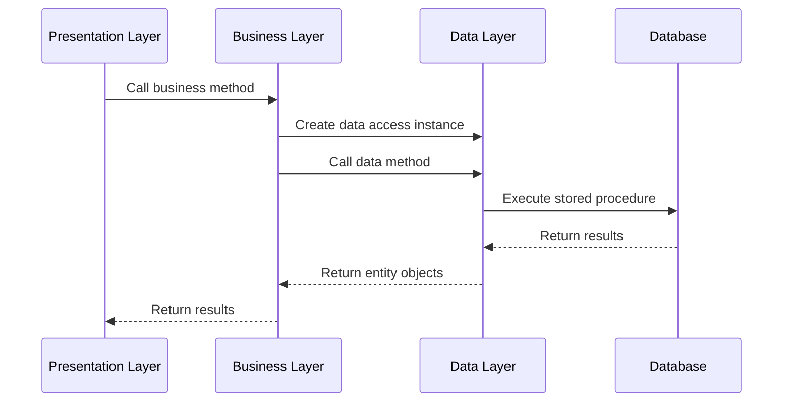

## Overview

The **Business Logic Layer** (capa_negocio) sits between the presentation and data layers, orchestrating operations and enforcing business rules. This layer ensures that all business logic is centralized and reusable across different presentation interfaces.

## Responsibilities

The business layer handles:

- Orchestrating calls to the data layer
- Implementing business rules and validations
- Coordinating operations across multiple data access classes
- Providing a clean API for the presentation layer
- Ensuring data integrity and business constraints

## Business Layer Classes

Each domain entity has a corresponding business logic class:

<CardGroup cols={3}>
  <Card title="CN_Canchas" icon="futbol">
    Soccer field management logic
  </Card>
  <Card title="CN_Clientes" icon="users">
    Client management logic
  </Card>
  <Card title="CN_Reservas" icon="calendar">
    Reservation management logic
  </Card>
</CardGroup>

## CN_Canchas Class

The `CN_Canchas` class manages business logic for soccer fields.

### Complete Implementation

From `capa_negocio/CN_canchas.cs`:

```csharp
using System;
using System.Collections.Generic;
using System.Linq;
using capa_entidad;
using capa_dato;

namespace capa_negocio
{
    public class CN_Canchas
    {
        CD_Canchas oCD_Canchas = new CD_Canchas();

        public List<CE_Canchas> ListarCanchas()
        {
            oCD_Canchas = new CD_Canchas();
            return oCD_Canchas.Listar();
        }

        public void AgregarCancha(CE_Canchas cancha)
        {
            oCD_Canchas.AgregarCancha(cancha);
        }

        public void Actualizar(CE_Canchas cancha)
        {
            oCD_Canchas.ActualizarCancha(cancha);
        }

        public void Eliminar(int id)
        {
            oCD_Canchas.EliminarCancha(id);
        }
    }
}
```

### Key Characteristics

<AccordionGroup>
  <Accordion title="Data Layer Abstraction">
    The business layer creates instances of data access classes and delegates database operations:
    
    ```csharp
    CD_Canchas oCD_Canchas = new CD_Canchas();
    return oCD_Canchas.Listar();
    ```
  </Accordion>

  <Accordion title="Simplified Method Names">
    Business layer methods have cleaner names than data layer methods:
    
    - Business: `ListarCanchas()` → Data: `Listar()`
    - Business: `AgregarCancha()` → Data: `AgregarCancha()`
    - Business: `Actualizar()` → Data: `ActualizarCancha()`
  </Accordion>

  <Accordion title="Single Responsibility">
    Each method handles one specific business operation, making the code easy to understand and maintain.
  </Accordion>
</AccordionGroup>

## CN_Clientes Class

The `CN_Clientes` class manages business logic for clients.

### Complete Implementation

From `capa_negocio/CN_Clientes.cs`:

```csharp
using System;
using System.Collections;
using System.Collections.Generic;
using System.Linq;
using capa_dato;
using capa_entidad;

namespace capa_negocio
{
    public class CN_Clientes
    {
        CD_Clientes oCD_Clientes = new CD_Clientes();

        public List<CE_Clientes> Listar()
        {
            List<CE_Clientes> lista = oCD_Clientes.ListarClientes();
            if (lista == null)
            {
                return new List<CE_Clientes>();
            }
            return lista;
        }

        public void Insertar(CE_Clientes cliente)
        {
            oCD_Clientes.InsertarClientes(cliente);
        }

        public void Actualizar(CE_Clientes cliente)
        {
            oCD_Clientes.ActualizarClientes(cliente);
        }

        public void Eliminar(int id)
        {
        oCD_Clientes.EliminarClientes(id);
        }
    }
}
```

### Business Logic Features

#### Null Safety

From `CN_Clientes.cs:21-30`, the `Listar` method includes null checking:

```csharp
public List<CE_Clientes> Listar()
{
    List<CE_Clientes> lista = oCD_Clientes.ListarClientes();
    if (lista == null)
    {
        return new List<CE_Clientes>();
    }
    return lista;
}
```

<Info>
  This prevents null reference exceptions in the presentation layer by always returning a valid list (even if empty).
</Info>

## CN_Reservas Class

The `CN_Reservas` class handles reservation business logic, including filtering and search functionality.

### Complete Implementation

From `capa_negocio/CN_Reservas.cs`:

```csharp
using System;
using System.Collections.Generic;
using System.Linq;
using capa_entidad;
using capa_dato;

namespace capa_negocio
{
    public class CN_Reservas
    {
        CD_Reservas oCD_Reservas = new CD_Reservas();

        public List<CE_Reservas> Listar()
        {
            oCD_Reservas = new CD_Reservas();
            return oCD_Reservas.Listar();
        }

        public void InsertarReservas(ReservaViewModel reserva)
        {
            oCD_Reservas.InsertarReserva(reserva);
        }

        public void Actualizar(CE_Reservas reserva)
        {
            oCD_Reservas.ActualizarReserva(reserva);
        }

        public void Eliminar(int id)
        {
            oCD_Reservas.EliminarReserva(id);
        }

        public List<CE_Reservas> ListarNombre(string BuscarNombreReserva) 
        {
            return oCD_Reservas.ListarNombre(BuscarNombreReserva);
        }
    }
}
```

### Advanced Features

#### Search Functionality

The `ListarNombre` method provides filtered search capabilities:

```csharp
public List<CE_Reservas> ListarNombre(string BuscarNombreReserva) 
{
    return oCD_Reservas.ListarNombre(BuscarNombreReserva);
}
```

This method:
- Accepts a search term from the presentation layer
- Delegates the filtered query to the data layer
- Returns only reservations matching the search criteria

#### ViewModel Support

The insert method accepts a `ReservaViewModel` instead of a simple entity:

```csharp
public void InsertarReservas(ReservaViewModel reserva)
{
    oCD_Reservas.InsertarReserva(reserva);
}
```

<Note>
  The `ReservaViewModel` contains not just the reservation entity, but also lists of available clients and fields for dropdown menus.
</Note>

## Layer Communication Pattern

The business layer follows a consistent pattern for communicating with the data layer:



## Dependency Injection Pattern

Each business class creates an instance of its corresponding data access class:

```csharp
public class CN_Canchas
{
    CD_Canchas oCD_Canchas = new CD_Canchas();
    // Business methods use oCD_Canchas
}
```

<Warning>
  This is a simple form of dependency management. For larger applications, consider using a dependency injection framework like Microsoft.Extensions.DependencyInjection.
</Warning>

## Method Naming Conventions

Business layer methods follow clear naming patterns:

| Operation | Method Name | Example |
|-----------|-------------|----------|
| Retrieve all | `Listar()` or `Listar[Entity]()` | `ListarCanchas()` |
| Search/Filter | `Listar[Criteria]()` | `ListarNombre(string)` |
| Create | `Insertar()` or `Agregar[Entity]()` | `AgregarCancha()` |
| Update | `Actualizar()` | `Actualizar(CE_Canchas)` |
| Delete | `Eliminar()` | `Eliminar(int id)` |

## Entity Objects

Business methods accept and return entity objects from `capa_entidad`:

```csharp
// Method accepting entity
public void AgregarCancha(CE_Canchas cancha)

// Method returning list of entities
public List<CE_Canchas> ListarCanchas()
```

## Business Logic Examples

### Example 1: Adding a Soccer Field

```csharp
// In presentation layer
var nuevaCancha = new CE_Canchas 
{ 
    Nombre = "Cancha Principal",
    Tipo = "Fútbol 11",
    PrecioPorHora = 150.00m
};

// Business layer orchestrates the operation
var cnCanchas = new CN_Canchas();
cnCanchas.AgregarCancha(nuevaCancha);

// Business layer delegates to data layer
// Data layer executes SP_Canchas_Insert stored procedure
```

### Example 2: Searching Reservations

```csharp
// In presentation layer
string searchTerm = "Juan";

// Business layer provides search functionality
var cnReservas = new CN_Reservas();
var resultados = cnReservas.ListarNombre(searchTerm);

// Returns filtered list of reservations
foreach (var reserva in resultados)
{
    Console.WriteLine($"{reserva.NombreCliente} - {reserva.FechaReserva}");
}
```

### Example 3: Updating a Client

```csharp
// In presentation layer
var cliente = new CE_Clientes
{
    IdCliente = 5,
    Nombre = "María López",
    Telefono = "555-1234",
    Correo = "maria@example.com",
    Estado = true
};

// Business layer processes update
var cnClientes = new CN_Clientes();
cnClientes.Actualizar(cliente);

// Data layer executes SP_Clientes_Update
```

## Where to Add Business Rules

This layer is the ideal place to add:

<Check>**Validation Logic**: Verify data meets business requirements</Check>
<Check>**Authorization Checks**: Ensure users have permission</Check>
<Check>**Calculations**: Compute prices, totals, or derived values</Check>
<Check>**Cross-Entity Operations**: Coordinate multiple data operations</Check>
<Check>**Transaction Management**: Ensure data consistency</Check>

### Example: Adding Price Calculation

```csharp
public decimal CalcularCostoReserva(int idReserva)
{
    // Get reservation details
    var reserva = oCD_Reservas.Listar()
        .FirstOrDefault(r => r.IdReserva == idReserva);
    
    if (reserva == null) return 0;
    
    // Get field price
    var cancha = new CD_Canchas().Listar()
        .FirstOrDefault(c => c.IdCancha == reserva.IdCancha);
    
    // Calculate duration in hours
    var duracion = (reserva.HoraFin - reserva.HoraInicio).TotalHours;
    
    // Return total cost
    return (decimal)duracion * cancha.PrecioPorHora;
}
```

## Benefits of the Business Layer

<AccordionGroup>
  <Accordion title="Centralized Business Logic">
    All business rules are in one place, making them easy to find, update, and test.
  </Accordion>

  <Accordion title="Presentation Independence">
    The same business logic can serve web controllers, APIs, console apps, or mobile apps.
  </Accordion>

  <Accordion title="Testability">
    Business logic can be tested independently of database or UI concerns.
  </Accordion>

  <Accordion title="Consistency">
    All parts of the application use the same business rules, preventing discrepancies.
  </Accordion>
</AccordionGroup>

## Layer Dependencies

The business layer depends on:

- **capa_dato**: Data access classes for database operations
- **capa_entidad**: Entity classes for data transfer
- **System.Collections.Generic**: For working with lists
- **System.Linq**: For data querying and filtering

The business layer is used by:

- **capa_presentacion**: Controllers that handle HTTP requests

## Next Steps

<CardGroup cols={2}>
  <Card title="Presentation Layer" icon="desktop" href="/architecture/presentation-layer">
    Learn how controllers use business layer classes
  </Card>
  <Card title="Data Layer" icon="database" href="/architecture/data-layer">
    Understand the data access methods being called
  </Card>
</CardGroup>
