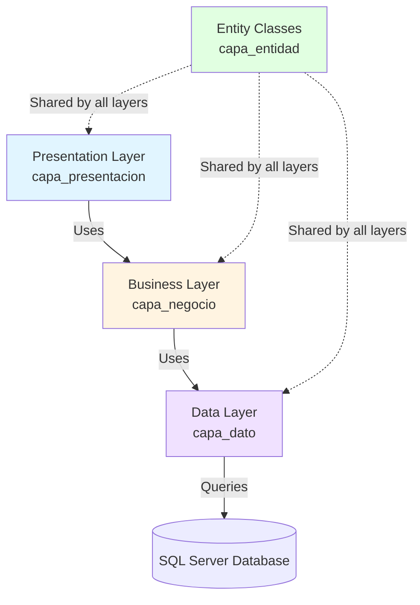

## Introduction

Canchas Deportivas is built using a **three-tier architecture** (also known as n-tier or layered architecture), a well-established software design pattern that separates concerns into three distinct layers. This architectural pattern promotes maintainability, scalability, and separation of concerns.

## Three-Tier Architecture Pattern

The application is organized into three logical layers, each with specific responsibilities:

<CardGroup cols={3}>
  <Card title="Presentation Layer" icon="desktop" href="/architecture/presentation-layer">
    User interface and controllers that handle HTTP requests
  </Card>
  <Card title="Business Layer" icon="brain" href="/architecture/business-layer">
    Business logic and rules that orchestrate operations
  </Card>
  <Card title="Data Layer" icon="database" href="/architecture/data-layer">
    Data access and database communication
  </Card>
</CardGroup>

## Layer Structure

The codebase is physically organized into separate namespaces that correspond to each layer:

```plaintext
Canchas Deportivas/
├── capa_presentacion/          # Presentation Layer
│   ├── Controllers/
│   │   ├── CanchasController.cs
│   │   ├── ClientesController.cs
│   │   └── ReservasController.cs
│   └── Models/
│       └── *ViewModel.cs
│
├── capa_negocio/               # Business Layer
│   ├── CN_Canchas.cs
│   ├── CN_Clientes.cs
│   └── CN_Reservas.cs
│
├── capa_dato/                  # Data Layer
│   ├── CD_conexion.cs
│   ├── CD_Canchas.cs
│   ├── CD_Clientes.cs
│   └── CD_Reservas.cs
│
└── capa_entidad/               # Entity Classes (shared)
    ├── CE_Canchas.cs
    ├── CE_Clientes.cs
    └── CE_Reservas.cs
```

## How Layers Interact

The layers follow a strict hierarchical communication pattern where each layer only communicates with the layer directly below it:



### Data Flow Example

Let's trace how a request to list all soccer fields flows through the system:

1. **User Request**: Browser sends GET request to `/Canchas/ListarCanchas`

2. **Presentation Layer**: `CanchasController` receives the request
   ```csharp
   // capa_presentacion/Controllers/CanchasController.cs
   CN_Canchas Canchas = new CN_Canchas();
   var olista = Canchas.ListarCanchas();
   ```

3. **Business Layer**: `CN_Canchas` processes the request
   ```csharp
   // capa_negocio/CN_Canchas.cs
   CD_Canchas oCD_Canchas = new CD_Canchas();
   return oCD_Canchas.Listar();
   ```

4. **Data Layer**: `CD_Canchas` executes database query
   ```csharp
   // capa_dato/CD_Canchas.cs
   using (var comando = new SqlCommand("SP_Canchas_List", conexionAbierta))
   {
       // Execute stored procedure and return List<CE_Canchas>
   }
   ```

5. **Response**: Data flows back up through the layers to the view

## Entity Classes (Domain Models)

The `capa_entidad` namespace contains entity classes that represent domain objects. These classes are shared across all layers:

```csharp
namespace capa_entidad
{
    public class CE_Canchas
    {
        public int IdCancha { get; set; }
        public string? Nombre { get; set; }
        public string? Tipo { get; set; }
        public decimal PrecioPorHora { get; set; }
        public string? Estado { get; set; }
    }
}
```

## Key Architectural Benefits

<AccordionGroup>
  <Accordion title="Separation of Concerns">
    Each layer has a single, well-defined responsibility. The presentation layer handles UI concerns, business layer contains logic, and data layer manages persistence.
  </Accordion>

  <Accordion title="Maintainability">
    Changes to one layer typically don't require changes to other layers. For example, you can modify the database structure without affecting controllers.
  </Accordion>

  <Accordion title="Testability">
    Each layer can be tested independently. Business logic can be tested without requiring a database or UI.
  </Accordion>

  <Accordion title="Reusability">
    Business logic can be reused across different presentation layers (Web, API, Mobile, etc.).
  </Accordion>

  <Accordion title="Scalability">
    Layers can be deployed on different servers. For example, the data layer can be on a dedicated database server.
  </Accordion>
</AccordionGroup>

## Naming Conventions

The project follows consistent naming conventions:

- **Presentation Layer**: Controllers and ViewModels
- **Business Layer**: `CN_` prefix (Capa Negocio)
- **Data Layer**: `CD_` prefix (Capa Dato)
- **Entity Classes**: `CE_` prefix (Capa Entidad)

## Database Communication

All database operations use:
- **SQL Server** as the database engine
- **Stored Procedures** for all CRUD operations
- **ADO.NET** with `SqlCommand` and `SqlConnection`
- **Centralized Connection Management** via `CD_conexion` class

## Next Steps

<CardGroup cols={3}>
  <Card title="Data Layer" icon="database" href="/architecture/data-layer">
    Learn about database access and connection management
  </Card>
  <Card title="Business Layer" icon="brain" href="/architecture/business-layer">
    Understand business logic and orchestration
  </Card>
  <Card title="Presentation Layer" icon="desktop" href="/architecture/presentation-layer">
    Explore controllers and user interface handling
  </Card>
</CardGroup>
