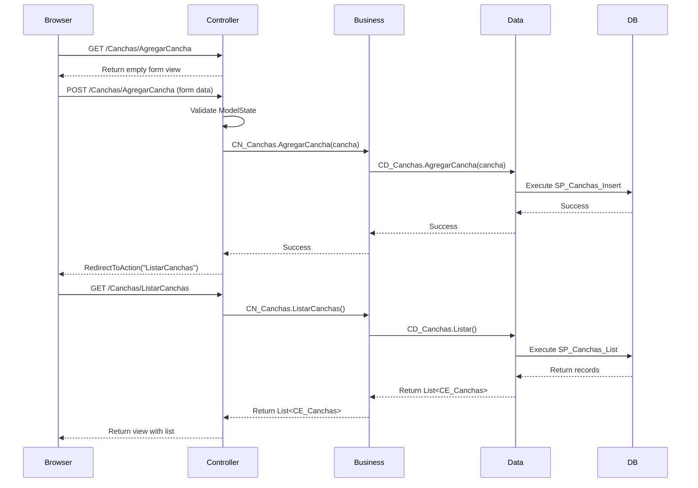

## Overview

The **Presentation Layer** (capa_presentacion) is responsible for handling HTTP requests, user input, and rendering views. Built with **ASP.NET Core MVC**, this layer serves as the entry point for all user interactions with the application.

## Responsibilities

The presentation layer handles:

- Receiving and validating HTTP requests
- Calling business layer methods to perform operations
- Passing data to views for rendering
- Handling form submissions and user input
- Managing navigation and redirects
- Error handling and user feedback

## Project Structure

```plaintext
capa_presentacion/
├── Controllers/
│   ├── CanchasController.cs      # Soccer field operations
│   ├── ClientesController.cs     # Client management
│   ├── ReservasController.cs     # Reservation management
│   └── HomeController.cs         # Home page
├── Models/
│   ├── CanchaViewModel.cs        # View-specific models
│   ├── ReservaViewModel.cs
│   └── ErrorViewModel.cs
├── Views/
│   ├── Canchas/
│   ├── Clientes/
│   ├── Reservas/
│   └── Shared/
└── Program.cs                     # Application entry point
```

## MVC Pattern

The presentation layer follows the **Model-View-Controller (MVC)** pattern:

<CardGroup cols={3}>
  <Card title="Model" icon="cube">
    Entity and ViewModel classes that represent data
  </Card>
  <Card title="View" icon="eye">
    Razor pages (.cshtml) that render HTML
  </Card>
  <Card title="Controller" icon="gears">
    Classes that handle requests and coordinate responses
  </Card>
</CardGroup>

## Controllers

Controllers are the heart of the presentation layer, handling HTTP requests and coordinating responses.

### CanchasController

Manages soccer field operations. From `capa_presentacion/Controllers/CanchasController.cs`:

```csharp
using Microsoft.AspNetCore.Mvc;
using capa_entidad;
using capa_negocio;

namespace capa_presentacion.Controllers
{
    public class CanchasController : Controller
    {
        CN_Canchas Canchas = new CN_Canchas();

        public ActionResult ListarCanchas()
        {
            try
            {
                if (!ModelState.IsValid)
                {
                    throw new Exception("El estado del modelo no es válido.");
                }

                var olista = Canchas.ListarCanchas();
                return View(olista);
            }
            catch (Exception ex)
            {
                TempData["ErrorMessage"] = "Error al obtener la lista de canchas: " + ex.Message;
                return View(new List<CE_Canchas>());
            }
        }
    }
}
```

### Controller Components

#### Business Layer Instance

Each controller creates an instance of its corresponding business class:

```csharp
public class CanchasController : Controller
{
    CN_Canchas Canchas = new CN_Canchas();
    // Controller methods use this instance
}
```

#### Action Methods

Action methods handle specific routes and operations:

```csharp
// GET: /Canchas/ListarCanchas
public ActionResult ListarCanchas()
{
    var olista = Canchas.ListarCanchas();
    return View(olista);
}
```

## CRUD Operations in Controllers

### Listing Records (Read)

From `CanchasController.cs:17-40`:

```csharp
public ActionResult ListarCanchas()
{
    try
    {
        if (!ModelState.IsValid)
        {
            throw new Exception("El estado del modelo no es válido.");
        }

        var olista = Canchas.ListarCanchas();
        return View(olista);
    }
    catch (Exception ex)
    {
        TempData["ErrorMessage"] = "Error al obtener la lista de canchas: " + ex.Message;
        return View(new List<CE_Canchas>());
    }
}
```

<Info>
  The controller calls `Canchas.ListarCanchas()` from the business layer and passes the result to the view.
</Info>

### Creating Records (Create)

Creating a record typically involves two action methods:

#### GET Method (Display Form)

From `CanchasController.cs:43-50`:

```csharp
public ActionResult AgregarCancha()
{
    return View();
}
```

#### POST Method (Process Form)

From `CanchasController.cs:53-73`:

```csharp
[HttpPost]
public ActionResult AgregarCancha(CE_Canchas cancha)
{
    try
    {
        if (!ModelState.IsValid) 
        {
            return StatusCode(404, $"No se encontro el modelo");
        }

        Canchas.AgregarCancha(cancha);
        return RedirectToAction("ListarCanchas");
    }
    catch (Exception ex)
    {
        return StatusCode(500, $"Error al agregar la cancha: {ex.Message} ");
    }
}
```

### Updating Records (Update)

#### GET Method (Load Existing Data)

From `CanchasController.cs:79-91`:

```csharp
[HttpGet]
public ActionResult Actualizar(int id)
{
    var lista = Canchas.ListarCanchas();
    var cancha = lista.FirstOrDefault(c => c.IdCancha == id);

    if (cancha == null)
    {
        return NotFound($"no se puedo actualizar la cancha con el id: {id}");
    }
    return View(cancha);
}
```

#### POST Method (Save Changes)

From `CanchasController.cs:95-117`:

```csharp
[HttpPost]
public ActionResult Actualizar(CE_Canchas cancha)
{
    try
    {
        if (ModelState.IsValid)
        {
            Canchas.Actualizar(cancha);
            return RedirectToAction("ListarCanchas");
        }
        Canchas.Actualizar(cancha);
        return RedirectToAction("ListarCanchas");
    }
    catch (Exception ex)
    {
        return StatusCode(500, $"Error al actualizar la cancha: {ex.Message} ");
    }
}
```

### Deleting Records (Delete)

From `CanchasController.cs:121-125`:

```csharp
[HttpPost]
public ActionResult Eliminar(int id)
{
    Canchas.Eliminar(id);
    return RedirectToAction("ListarCanchas");
}
```

## ClientesController

Manages client operations with similar CRUD patterns. From `capa_presentacion/Controllers/ClientesController.cs`:

```csharp
using Microsoft.AspNetCore.Mvc;
using capa_negocio;
using capa_entidad;

namespace capa_presentacion.Controllers
{
    public class ClientesController : Controller
    {
        CN_Clientes Clientes = new CN_Clientes();

        public ActionResult ListarClientes()
        {
            try
            {
                if (!ModelState.IsValid)
                {
                    throw new Exception("El estado del modelo no es válido.");
                }
                var olista = Clientes.Listar();
                return View(olista);
            }
            catch (Exception ex)
            {
                TempData["ErrorMessage"] = "Error al obtener la lista de clientes: " + ex.Message;
                return View(new List<CE_Clientes>());
            }
        }

        // Additional CRUD methods...
    }
}
```

## ReservasController

The most complex controller, handling reservations and search functionality.

### ViewModel Pattern

Reservations use a ViewModel to combine multiple data sources. From `ReservasController.cs:35-50`:

```csharp
public ActionResult InsertarReservas()
{
    // Create the ViewModel package
    ReservaViewModel modelo = new ReservaViewModel();

    // Load dropdown data from multiple business layer classes
    modelo.ListaClientes = new CN_Clientes().Listar();
    modelo.ListaCanchas = new CN_Canchas().ListarCanchas();

    // Initialize the reservation entity
    modelo.Reserva = new CE_Reservas();

    // Pass the complete model to the view
    return View(modelo);
}
```

<Note>
  The ViewModel contains:
  - `Reserva`: The main reservation entity
  - `ListaClientes`: Available clients for dropdown
  - `ListaCanchas`: Available soccer fields for dropdown
</Note>

### Search Functionality

From `ReservasController.cs:147-168`:

```csharp
[HttpGet]
public ActionResult BuscarReservaNombre() 
{
    return View();
}

[HttpPost]
public ActionResult BuscarReservaNombre(string BuscarReservaNombre) 
{
    if (string.IsNullOrEmpty(BuscarReservaNombre)) 
    {
        var olis = Reservas.Listar();
        return View(olis);
    }

    var filtro = Reservas.ListarNombre(BuscarReservaNombre);
    return View(filtro);
}
```

## HTTP Attributes

Controllers use attributes to specify HTTP methods:

```csharp
[HttpGet]    // Handles GET requests (display forms)
[HttpPost]   // Handles POST requests (form submissions)
```

<AccordionGroup>
  <Accordion title="[HttpGet] - Display Forms">
    Used for action methods that display forms or pages. This is the default if no attribute is specified.
    
    ```csharp
    [HttpGet]
    public ActionResult Actualizar(int id)
    {
        // Load data and display edit form
    }
    ```
  </Accordion>

  <Accordion title="[HttpPost] - Process Forms">
    Used for action methods that process form submissions and perform data modifications.
    
    ```csharp
    [HttpPost]
    public ActionResult AgregarCancha(CE_Canchas cancha)
    {
        // Process form and save data
    }
    ```
  </Accordion>
</AccordionGroup>

## Return Types

Controllers return different types based on the operation:

### View Results

Return a view with optional data:

```csharp
return View();              // Return view without data
return View(olista);        // Return view with model data
```

### Redirects

Redirect to another action after an operation:

```csharp
return RedirectToAction("ListarCanchas");  // Redirect to listing page
```

### Status Codes

Return HTTP status codes for errors:

```csharp
return StatusCode(404, "No se encontró el modelo");
return StatusCode(500, $"Error: {ex.Message}");
return NotFound($"Cliente con id {id} no encontrado");
```

## Error Handling

Controllers implement comprehensive error handling:

### Try-Catch Blocks

```csharp
try
{
    if (!ModelState.IsValid)
    {
        throw new Exception("El estado del modelo no es válido.");
    }
    var olista = Canchas.ListarCanchas();
    return View(olista);
}
catch (Exception ex)
{
    TempData["ErrorMessage"] = "Error al obtener la lista: " + ex.Message;
    return View(new List<CE_Canchas>());
}
```

### TempData for Messages

`TempData` is used to pass error messages to views:

```csharp
TempData["ErrorMessage"] = "Error al obtener la lista de canchas: " + ex.Message;
```

<Info>
  TempData persists for a single redirect, making it perfect for displaying messages after POST operations.
</Info>

## Model Validation

Controllers validate model state before processing:

```csharp
if (!ModelState.IsValid)
{
    return StatusCode(404, "No se encontró el modelo");
}
```

`ModelState.IsValid` checks:
- Required fields are present
- Data types match
- Custom validation attributes

## Request Flow Example

Let's trace a complete request to add a soccer field:



## ViewModels

ViewModels are specialized classes that combine data for views:

### ReservaViewModel

From `capa_entidad/CE_Reservas.cs:33-39`:

```csharp
public class ReservaViewModel
{
    public CE_Reservas Reserva { get; set; }
    public List<CE_Clientes> ListaClientes { get; set; }
    public List<CE_Canchas> ListaCanchas { get; set; }
}
```

<Check>**Use ViewModels when:**</Check>
- A view needs data from multiple entities
- The view needs different data than the entity provides
- You need to combine entity data with UI-specific data

## Routing

MVC uses convention-based routing:

```plaintext
/{controller}/{action}/{id?}

Examples:
/Canchas/ListarCanchas           → CanchasController.ListarCanchas()
/Canchas/Actualizar/5            → CanchasController.Actualizar(5)
/Clientes/InsertarClientes       → ClientesController.InsertarClientes()
```

## Best Practices

<Check>**Keep controllers thin** - Delegate business logic to the business layer</Check>
<Check>**Validate input** - Always check ModelState before processing</Check>
<Check>**Handle errors gracefully** - Use try-catch and return meaningful messages</Check>
<Check>**Use appropriate HTTP methods** - GET for reads, POST for writes</Check>
<Check>**Redirect after POST** - Prevent duplicate submissions (PRG pattern)</Check>

<Warning>
  Never put business logic in controllers. Controllers should only orchestrate calls to the business layer.
</Warning>

## Common Patterns

### PRG Pattern (Post-Redirect-Get)

After processing a POST request, redirect to a GET action:

```csharp
[HttpPost]
public ActionResult AgregarCancha(CE_Canchas cancha)
{
    Canchas.AgregarCancha(cancha);
    return RedirectToAction("ListarCanchas");  // Redirect to GET action
}
```

This prevents duplicate submissions if the user refreshes the page.

### Entity Lookup Pattern

For update operations, retrieve the existing entity:

```csharp
public ActionResult Actualizar(int id)
{
    var lista = Canchas.ListarCanchas();
    var cancha = lista.FirstOrDefault(c => c.IdCancha == id);
    
    if (cancha == null)
    {
        return NotFound($"Cancha con id {id} no encontrada");
    }
    return View(cancha);
}
```

## Layer Dependencies

The presentation layer depends on:

- **Microsoft.AspNetCore.Mvc**: MVC framework
- **capa_negocio**: Business layer classes
- **capa_entidad**: Entity and ViewModel classes
- **System.Linq**: For data filtering (FirstOrDefault)

The presentation layer is the top layer:

- **No other layers depend on it**
- It's the entry point for all user interactions
- It can be replaced without affecting business or data layers

## Next Steps

<CardGroup cols={2}>
  <Card title="Business Layer" icon="brain" href="/architecture/business-layer">
    Understand the business logic being called from controllers
  </Card>
  <Card title="Architecture Overview" icon="sitemap" href="/architecture/overview">
    Review the complete three-tier architecture
  </Card>
</CardGroup>
