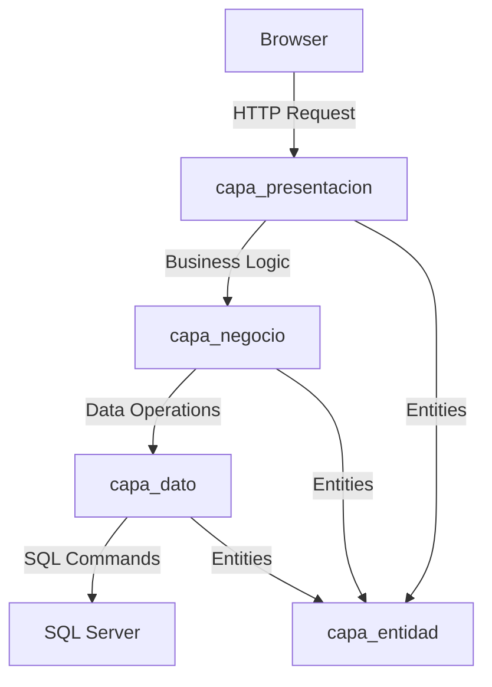

## Overview

This guide provides comprehensive instructions for installing and configuring the Canchas Deportivas sports field booking system. Follow these steps to set up a complete development or production environment.

<Note>
  For a faster setup, see the [Quick Start Guide](/quickstart). This guide covers advanced configuration, security, and production deployment considerations.
</Note>

## System Requirements

### Software Prerequisites

<CardGroup cols={2}>
  <Card title=".NET SDK" icon="microsoft">
    **.NET 8.0 SDK or higher**
    
    Download from [dotnet.microsoft.com](https://dotnet.microsoft.com/download)
    
    Verify installation:
    ```bash
    dotnet --version
    ```
  </Card>
  
  <Card title="SQL Server" icon="database">
    **SQL Server 2019 or higher**
    
    Options:
    - SQL Server Express (free)
    - SQL Server Developer Edition
    - Azure SQL Database
    
    Includes SQL Server Management Studio (SSMS) recommended
  </Card>
  
  <Card title="IDE" icon="code">
    **Development Environment**
    
    Choose one:
    - Visual Studio 2022 (Community or higher)
    - Visual Studio Code with C# extension
    - JetBrains Rider
  </Card>
  
  <Card title="Git" icon="git-alt">
    **Version Control**
    
    Required for cloning the repository
    
    Download from [git-scm.com](https://git-scm.com/)
  </Card>
</CardGroup>

### Hardware Requirements

- **CPU**: Dual-core processor (2 GHz or faster)
- **RAM**: 4 GB minimum (8 GB recommended)
- **Disk Space**: 10 GB free space
- **OS**: Windows 10/11, Windows Server 2019+, Linux, or macOS

## Installation Steps

<Steps>
  <Step title="Install .NET 8.0 SDK">
    Download and install the .NET 8.0 SDK:
    
    <CodeGroup>
    ```bash Windows
    # Download from https://dotnet.microsoft.com/download
    # Or use winget
    winget install Microsoft.DotNet.SDK.8
    ```
    
    ```bash macOS
    brew install dotnet@8
    ```
    
    ```bash Linux (Ubuntu)
    wget https://dot.net/v1/dotnet-install.sh -O dotnet-install.sh
    chmod +x ./dotnet-install.sh
    ./dotnet-install.sh --version 8.0
    ```
    </CodeGroup>
    
    Verify the installation:
    ```bash
    dotnet --info
    ```
  </Step>

  <Step title="Install SQL Server">
    Download and install SQL Server:
    
    **For Development (SQL Server Express):**
    1. Download from [Microsoft SQL Server Express](https://www.microsoft.com/sql-server/sql-server-downloads)
    2. Run the installer and choose "Basic" installation
    3. Note the server instance name (typically `localhost\SQLEXPRESS`)
    4. Install SQL Server Management Studio (SSMS) for database management
    
    **For Production:**
    - Use SQL Server Standard/Enterprise edition
    - Or Azure SQL Database for cloud deployment
    
    <Warning>
      Enable TCP/IP protocol in SQL Server Configuration Manager for remote connections.
    </Warning>
  </Step>

  <Step title="Clone the Repository">
    Get the source code:
    
    ```bash
    git clone <repository-url> canchas-deportivas
    cd canchas-deportivas
    ```
    
    The project structure:
    ```
    canchas-deportivas/
    └── source/
        ├── capa_presentacion/     # ASP.NET Core MVC project
        ├── capa_negocio/          # Business logic layer
        ├── capa_dato/             # Data access layer
        └── capa_entidad/          # Entity models
    ```
  </Step>

  <Step title="Restore NuGet Packages">
    Navigate to the solution directory and restore dependencies:
    
    ```bash
    cd source
    dotnet restore
    ```
    
    This will install:
    - **Microsoft.Data.SqlClient** (v6.1.2) - SQL Server connectivity
    - **Microsoft.VisualStudio.Web.CodeGeneration.Design** (v8.0.7) - Scaffolding tools
    
    Verify packages:
    ```bash
    dotnet list package
    ```
  </Step>

  <Step title="Configure Database Connection">
    Update the connection string in the data layer:
    
    **File**: `source/capa_dato/CD_conexion.cs`
    
    ```csharp capa_dato/CD_conexion.cs
    public class CD_conexion
    {
        private readonly SqlConnection conexion = new SqlConnection(
            "Data Source=YOUR_SERVER_NAME;" +
            "Initial Catalog=DB_canchasdeportivas;" +
            "Integrated Security=True;" +
            "Encrypt=True;" +
            "Trust Server Certificate=True"
        );
        
        public SqlConnection abrir_conexion()
        {
            if (conexion.State == System.Data.ConnectionState.Closed)
            {
                conexion.Open();
            }
            return conexion;
        }
        
        public SqlConnection cerrar_conexion()
        {
            if (conexion.State == System.Data.ConnectionState.Open)
            {
                conexion.Close();
            }
            return conexion;
        }
    }
    ```
    
    **Connection String Components:**
    - `Data Source`: Your SQL Server instance (e.g., `localhost\SQLEXPRESS`)
    - `Initial Catalog`: Database name (`DB_canchasdeportivas`)
    - `Integrated Security=True`: Use Windows Authentication
    - `Encrypt=True`: Encrypt connection
    - `Trust Server Certificate=True`: Trust self-signed certificates
    
    <Tabs>
      <Tab title="Windows Authentication">
        ```csharp
        "Data Source=localhost\\SQLEXPRESS;" +
        "Initial Catalog=DB_canchasdeportivas;" +
        "Integrated Security=True;" +
        "Encrypt=True;Trust Server Certificate=True"
        ```
      </Tab>
      <Tab title="SQL Server Authentication">
        ```csharp
        "Data Source=localhost\\SQLEXPRESS;" +
        "Initial Catalog=DB_canchasdeportivas;" +
        "User Id=your_username;" +
        "Password=your_password;" +
        "Encrypt=True;Trust Server Certificate=True"
        ```
      </Tab>
      <Tab title="Azure SQL Database">
        ```csharp
        "Data Source=yourserver.database.windows.net;" +
        "Initial Catalog=DB_canchasdeportivas;" +
        "User Id=your_username@yourserver;" +
        "Password=your_password;" +
        "Encrypt=True;TrustServerCertificate=False"
        ```
      </Tab>
    </Tabs>
    
    <Warning>
      **Security Best Practice**: Store connection strings in environment variables or Azure Key Vault for production. Never commit credentials to source control.
    </Warning>
  </Step>

  <Step title="Create Database Schema">
    Open SQL Server Management Studio (SSMS) and connect to your server.
    
    **Create the Database:**
    ```sql
    CREATE DATABASE DB_canchasdeportivas;
    GO
    
    USE DB_canchasdeportivas;
    GO
    ```
    
    **Create Tables:**
    
    ```sql
    -- Canchas (Sports Fields) Table
    CREATE TABLE Canchas (
        IdCancha INT PRIMARY KEY IDENTITY(1,1),
        Nombre NVARCHAR(100) NOT NULL,
        Tipo NVARCHAR(50),
        PrecioPorHora DECIMAL(10,2) NOT NULL,
        Estado NVARCHAR(20),
        CONSTRAINT CK_PrecioPorHora CHECK (PrecioPorHora >= 0)
    );
    GO
    
    -- Clientes (Clients) Table
    CREATE TABLE Clientes (
        IdCliente INT PRIMARY KEY IDENTITY(1,1),
        Nombre NVARCHAR(100) NOT NULL,
        Telefono NVARCHAR(20),
        Email NVARCHAR(100),
        FechaRegistro DATETIME DEFAULT GETDATE(),
        CONSTRAINT UK_Email UNIQUE(Email)
    );
    GO
    
    -- Usuarios (Users) Table
    CREATE TABLE Usuarios (
        IdUsuario INT PRIMARY KEY IDENTITY(1,1),
        NombreUsuario NVARCHAR(50) NOT NULL UNIQUE,
        Password NVARCHAR(255) NOT NULL,
        FechaCreacion DATETIME DEFAULT GETDATE(),
        Activo BIT DEFAULT 1
    );
    GO
    
    -- TiposReservas (Reservation Types) Table
    CREATE TABLE TiposReservas (
        IdTipo INT PRIMARY KEY IDENTITY(1,1),
        NombreTipo NVARCHAR(50) NOT NULL,
        Descripcion NVARCHAR(200)
    );
    GO
    
    -- Reservas (Reservations) Table
    CREATE TABLE Reservas (
        IdReserva INT PRIMARY KEY IDENTITY(1,1),
        IdCancha INT NOT NULL,
        IdCliente INT NOT NULL,
        IdUsuario INT NOT NULL,
        FechaReserva DATE NOT NULL,
        HoraInicio TIME NOT NULL,
        HoraFin TIME NOT NULL,
        Comentario NVARCHAR(500),
        Estado BIT DEFAULT 1,
        FechaCreacion DATETIME DEFAULT GETDATE(),
        CONSTRAINT FK_Reservas_Canchas FOREIGN KEY (IdCancha) REFERENCES Canchas(IdCancha),
        CONSTRAINT FK_Reservas_Clientes FOREIGN KEY (IdCliente) REFERENCES Clientes(IdCliente),
        CONSTRAINT FK_Reservas_Usuarios FOREIGN KEY (IdUsuario) REFERENCES Usuarios(IdUsuario),
        CONSTRAINT CK_HoraInicio_HoraFin CHECK (HoraFin > HoraInicio)
    );
    GO
    
    -- Create indexes for better performance
    CREATE INDEX IX_Reservas_FechaReserva ON Reservas(FechaReserva);
    CREATE INDEX IX_Reservas_Cliente ON Reservas(IdCliente);
    CREATE INDEX IX_Reservas_Cancha ON Reservas(IdCancha);
    GO
    ```
  </Step>

  <Step title="Create Stored Procedures">
    The application uses stored procedures for all data operations. Create them in SQL Server:
    
    **Reservas Stored Procedures:**
    
    ```sql
    -- SP_Reservas_List: List all reservations with related data
    CREATE PROCEDURE SP_Reservas_List
    AS
    BEGIN
        SET NOCOUNT ON;
        
        SELECT 
            r.IdReserva,
            r.IdCancha,
            r.IdCliente,
            r.IdUsuario,
            r.FechaReserva,
            r.HoraInicio,
            r.HoraFin,
            r.Comentario,
            r.Estado,
            c.Nombre AS Nombre,
            ca.Nombre AS NombreCancha
        FROM Reservas r
        INNER JOIN Clientes c ON r.IdCliente = c.IdCliente
        INNER JOIN Canchas ca ON r.IdCancha = ca.IdCancha
        ORDER BY r.FechaReserva DESC, r.HoraInicio DESC;
    END;
    GO
    
    -- SP_Reservas_Insert: Insert new reservation
    CREATE PROCEDURE SP_Reservas_Insert
        @IdCancha INT,
        @IdCliente INT,
        @IdUsuario INT,
        @FechaReserva DATE,
        @HoraInicio TIME,
        @HoraFin TIME,
        @Comentario NVARCHAR(500)
    AS
    BEGIN
        SET NOCOUNT ON;
        
        -- Validate time slot is available
        IF EXISTS (
            SELECT 1 FROM Reservas 
            WHERE IdCancha = @IdCancha 
            AND FechaReserva = @FechaReserva
            AND Estado = 1
            AND (
                (@HoraInicio >= HoraInicio AND @HoraInicio < HoraFin) OR
                (@HoraFin > HoraInicio AND @HoraFin <= HoraFin) OR
                (@HoraInicio <= HoraInicio AND @HoraFin >= HoraFin)
            )
        )
        BEGIN
            RAISERROR('El horario seleccionado ya está reservado', 16, 1);
            RETURN;
        END
        
        INSERT INTO Reservas (
            IdCancha, IdCliente, IdUsuario, FechaReserva, 
            HoraInicio, HoraFin, Comentario, Estado
        )
        VALUES (
            @IdCancha, @IdCliente, @IdUsuario, @FechaReserva, 
            @HoraInicio, @HoraFin, @Comentario, 1
        );
        
        SELECT SCOPE_IDENTITY() AS NewReservaId;
    END;
    GO
    
    -- SP_Reservas_Update: Update existing reservation
    CREATE PROCEDURE SP_Reservas_Update
        @IdReserva INT,
        @IdCancha INT,
        @IdCliente INT,
        @IdUsuario INT,
        @FechaReserva DATE,
        @HoraInicio TIME,
        @HoraFin TIME,
        @Comentario NVARCHAR(500),
        @Estado BIT
    AS
    BEGIN
        SET NOCOUNT ON;
        
        UPDATE Reservas
        SET 
            IdCancha = @IdCancha,
            IdCliente = @IdCliente,
            IdUsuario = @IdUsuario,
            FechaReserva = @FechaReserva,
            HoraInicio = @HoraInicio,
            HoraFin = @HoraFin,
            Comentario = @Comentario,
            Estado = @Estado
        WHERE IdReserva = @IdReserva;
    END;
    GO
    
    -- SP_Reservas_Delete: Delete reservation
    CREATE PROCEDURE SP_Reservas_Delete
        @Id INT
    AS
    BEGIN
        SET NOCOUNT ON;
        DELETE FROM Reservas WHERE IdReserva = @Id;
    END;
    GO
    
    -- SP_Listar_Reservas_Nombre: Search by client name
    CREATE PROCEDURE SP_Listar_Reservas_Nombre
        @Buscar NVARCHAR(100)
    AS
    BEGIN
        SET NOCOUNT ON;
        
        SELECT 
            r.IdReserva,
            r.IdCancha,
            r.IdCliente,
            r.IdUsuario,
            r.FechaReserva,
            r.HoraInicio,
            r.HoraFin,
            r.Comentario,
            r.Estado,
            c.Nombre AS NombreCliente,
            ca.Nombre AS NombreCancha
        FROM Reservas r
        INNER JOIN Clientes c ON r.IdCliente = c.IdCliente
        INNER JOIN Canchas ca ON r.IdCancha = ca.IdCancha
        WHERE c.Nombre LIKE '%' + @Buscar + '%'
        ORDER BY r.FechaReserva DESC;
    END;
    GO
    ```
    
    <Note>
      Create similar stored procedures for Canchas, Clientes, and Usuarios tables following the same pattern (List, Insert, Update, Delete).
    </Note>
  </Step>

  <Step title="Seed Initial Data">
    Add sample data to test the application:
    
    ```sql
    -- Insert sample sports fields
    INSERT INTO Canchas (Nombre, Tipo, PrecioPorHora, Estado) VALUES
        ('Cancha Principal', 'Fútbol 11', 150.00, 'Disponible'),
        ('Cancha Norte', 'Fútbol 7', 100.00, 'Disponible'),
        ('Cancha Sur', 'Fútbol 5', 80.00, 'Disponible'),
        ('Cancha Este', 'Fútbol 7', 95.00, 'Mantenimiento'),
        ('Cancha Oeste', 'Fútbol 5', 75.00, 'Disponible');
    GO
    
    -- Insert sample clients
    INSERT INTO Clientes (Nombre, Telefono, Email) VALUES
        ('Juan Pérez', '555-0101', 'juan.perez@example.com'),
        ('María González', '555-0102', 'maria.gonzalez@example.com'),
        ('Carlos Rodríguez', '555-0103', 'carlos.rodriguez@example.com'),
        ('Ana Martínez', '555-0104', 'ana.martinez@example.com'),
        ('Luis Fernández', '555-0105', 'luis.fernandez@example.com');
    GO
    
    -- Insert default admin user
    INSERT INTO Usuarios (NombreUsuario, Password, Activo) VALUES
        ('admin', 'admin123', 1),
        ('operador', 'operador123', 1);
    GO
    
    -- Insert sample reservations
    INSERT INTO Reservas (IdCancha, IdCliente, IdUsuario, FechaReserva, HoraInicio, HoraFin, Comentario, Estado)
    VALUES
        (1, 1, 1, DATEADD(day, 1, GETDATE()), '18:00:00', '20:00:00', 'Partido amistoso', 1),
        (2, 2, 1, DATEADD(day, 2, GETDATE()), '16:00:00', '18:00:00', 'Entrenamiento', 1),
        (3, 3, 1, DATEADD(day, 1, GETDATE()), '19:00:00', '21:00:00', 'Torneo local', 1);
    GO
    ```
  </Step>

  <Step title="Configure Application Settings">
    Update `appsettings.json` in the presentation layer:
    
    **File**: `source/capa_presentacion/appsettings.json`
    
    ```json
    {
      "Logging": {
        "LogLevel": {
          "Default": "Information",
          "Microsoft.AspNetCore": "Warning"
        }
      },
      "AllowedHosts": "*",
      "ApplicationSettings": {
        "ApplicationName": "Canchas Deportivas",
        "Version": "1.0.0"
      }
    }
    ```
    
    For development environment (`appsettings.Development.json`):
    ```json
    {
      "Logging": {
        "LogLevel": {
          "Default": "Debug",
          "Microsoft.AspNetCore": "Information"
        }
      },
      "DetailedErrors": true
    }
    ```
  </Step>

  <Step title="Build the Solution">
    Compile all projects:
    
    ```bash
    cd source/capa_presentacion
    dotnet build --configuration Release
    ```
    
    Expected output:
    ```bash
    Build succeeded.
        0 Warning(s)
        0 Error(s)
    ```
    
    Build all projects in the solution:
    ```bash
    dotnet build ../capa_entidad/capa_entidad.csproj
    dotnet build ../capa_dato/capa_dato.csproj
    dotnet build ../capa_negocio/capa_negocio.csproj
    dotnet build capa_presentacion.csproj
    ```
  </Step>

  <Step title="Run the Application">
    Start the web application:
    
    ```bash
    dotnet run --project source/capa_presentacion/capa_presentacion.csproj
    ```
    
    Or for development with hot reload:
    ```bash
    dotnet watch run --project source/capa_presentacion/capa_presentacion.csproj
    ```
    
    The application will start and display:
    ```
    info: Microsoft.Hosting.Lifetime[14]
          Now listening on: http://localhost:5000
    info: Microsoft.Hosting.Lifetime[14]
          Now listening on: https://localhost:5001
    info: Microsoft.Hosting.Lifetime[0]
          Application started. Press Ctrl+C to shut down.
    ```
  </Step>

  <Step title="Verify Installation">
    Open a browser and test these endpoints:
    
    - **Home**: `http://localhost:5000/`
    - **Reservations List**: `http://localhost:5000/Reservas/ListarReservas`
    - **Create Reservation**: `http://localhost:5000/Reservas/InsertarReservas`
    - **Sports Fields**: `http://localhost:5000/Canchas`
    - **Clients**: `http://localhost:5000/Clientes`
    - **Search Reservations**: `http://localhost:5000/Reservas/BuscarReservaNombre`
    
    You should see the sample data populated in Step 8.
  </Step>
</Steps>

## Project Architecture

Understanding the three-tier architecture:



<CardGroup cols={2}>
  <Card title="capa_presentacion" icon="browser">
    **Presentation Layer**
    
    ASP.NET Core MVC controllers and views. Handles HTTP requests, renders UI, and manages user interactions.
    
    Key files:
    - Controllers (ReservasController, CanchasController)
    - Views (Razor .cshtml files)
    - wwwroot (static assets)
  </Card>
  
  <Card title="capa_negocio" icon="briefcase">
    **Business Logic Layer**
    
    Contains business rules, validation, and orchestration between presentation and data layers.
    
    Classes: CN_Reservas, CN_Canchas, CN_Clientes
  </Card>
  
  <Card title="capa_dato" icon="database">
    **Data Access Layer**
    
    Manages database connections and executes stored procedures. Uses ADO.NET with SqlConnection.
    
    Key components:
    - CD_conexion (connection management)
    - CD_Reservas, CD_Canchas (data operations)
  </Card>
  
  <Card title="capa_entidad" icon="cube">
    **Entity Layer**
    
    Domain models and ViewModels shared across all layers.
    
    Entities: CE_Reservas, CE_Canchas, CE_Clientes, ReservaViewModel
  </Card>
</CardGroup>

## Configuration Options

### Connection String Best Practices

<Warning>
  **Never hardcode connection strings in production!** Use environment variables or configuration management tools.
</Warning>

**Option 1: Environment Variables**
```csharp
string connectionString = Environment.GetEnvironmentVariable("DB_CONNECTION_STRING") 
    ?? "Data Source=localhost;Initial Catalog=DB_canchasdeportivas;Integrated Security=True;";
```

**Option 2: User Secrets (Development)**
```bash
dotnet user-secrets init
dotnet user-secrets set "ConnectionStrings:DefaultConnection" "your_connection_string"
```

**Option 3: Azure Key Vault (Production)**
Retrieve connection strings securely from Azure Key Vault at runtime.

### Application Settings

Modify `Program.cs` to add services:

```csharp capa_presentacion/Program.cs
var builder = WebApplication.CreateBuilder(args);

// Add services to the container.
builder.Services.AddControllersWithViews();

// Add session support (if needed)
builder.Services.AddSession(options =>
{
    options.IdleTimeout = TimeSpan.FromMinutes(30);
    options.Cookie.HttpOnly = true;
    options.Cookie.IsEssential = true;
});

var app = builder.Build();

// Configure the HTTP request pipeline.
if (!app.Environment.IsDevelopment())
{
    app.UseExceptionHandler("/Home/Error");
    app.UseHsts();
}

app.UseHttpsRedirection();
app.UseStaticFiles();
app.UseRouting();
app.UseAuthorization();
app.UseSession();

app.MapControllerRoute(
    name: "default",
    pattern: "{controller=Home}/{action=Index}/{id?}");

app.Run();
```

## Troubleshooting

<AccordionGroup>
  <Accordion title="Cannot connect to SQL Server" icon="plug">
    **Symptoms**: `SqlException: A network-related or instance-specific error`
    
    **Solutions**:
    1. Verify SQL Server is running:
       ```bash
       # Windows
       sc query MSSQL$SQLEXPRESS
       
       # Or check services.msc
       ```
    2. Enable TCP/IP in SQL Server Configuration Manager
    3. Check firewall allows SQL Server port (default 1433)
    4. Verify server name in connection string
    5. Test with SQL Server Management Studio first
  </Accordion>
  
  <Accordion title="Stored procedure not found" icon="database">
    **Symptoms**: `SqlException: Could not find stored procedure 'SP_Reservas_List'`
    
    **Solutions**:
    1. Verify database is selected:
       ```sql
       USE DB_canchasdeportivas;
       GO
       ```
    2. Check stored procedures exist:
       ```sql
       SELECT name FROM sys.procedures WHERE name LIKE 'SP_%';
       ```
    3. Recreate missing stored procedures from Step 7
    4. Ensure correct database in connection string
  </Accordion>
  
  <Accordion title="Authentication failed for user" icon="lock">
    **Symptoms**: Login failed for user 'NT AUTHORITY\SYSTEM'
    
    **Solutions**:
    - For Windows Authentication: Add your Windows user to SQL Server logins
    - For SQL Authentication: Create SQL login and grant permissions:
      ```sql
      CREATE LOGIN [username] WITH PASSWORD = 'password';
      USE DB_canchasdeportivas;
      CREATE USER [username] FOR LOGIN [username];
      ALTER ROLE db_owner ADD MEMBER [username];
      ```
  </Accordion>
  
  <Accordion title="Build errors - project references" icon="link">
    **Symptoms**: Project reference errors or missing types
    
    **Solutions**:
    1. Clean and rebuild:
       ```bash
       dotnet clean
       dotnet build
       ```
    2. Verify project references in .csproj files
    3. Restore NuGet packages:
       ```bash
       dotnet restore --force
       ```
  </Accordion>
  
  <Accordion title="Port already in use" icon="network-wired">
    **Symptoms**: `IOException: Failed to bind to address http://127.0.0.1:5000`
    
    **Solutions**:
    1. Change port in `Properties/launchSettings.json`
    2. Or specify port at runtime:
       ```bash
       dotnet run --urls "http://localhost:5002"
       ```
    3. Kill process using the port (Windows):
       ```bash
       netstat -ano | findstr :5000
       taskkill /PID <pid> /F
       ```
  </Accordion>
  
  <Accordion title="Views not found - 404 errors" icon="file-circle-xmark">
    **Symptoms**: 404 or view not found errors
    
    **Solutions**:
    1. Verify view files exist in correct folders:
       - `Views/Reservas/ListarReservas.cshtml`
       - `Views/Canchas/...`
       - `Views/Shared/_Layout.cshtml`
    2. Check controller action names match view names
    3. Ensure `_ViewImports.cshtml` and `_ViewStart.cshtml` exist
  </Accordion>
</AccordionGroup>

## Production Deployment

### Publishing the Application

Create a production build:

```bash
dotnet publish source/capa_presentacion/capa_presentacion.csproj \
  --configuration Release \
  --output ./publish
```

### IIS Deployment

<Steps>
  <Step title="Install ASP.NET Core Hosting Bundle">
    Download and install from [dotnet.microsoft.com](https://dotnet.microsoft.com/download/dotnet/8.0)
  </Step>
  
  <Step title="Create IIS Application Pool">
    - Open IIS Manager
    - Create new Application Pool
    - Set .NET CLR Version to "No Managed Code"
    - Set Managed Pipeline Mode to "Integrated"
  </Step>
  
  <Step title="Deploy Application">
    - Copy published files to IIS directory (e.g., `C:\inetpub\wwwroot\canchas`)
    - Create IIS site pointing to the directory
    - Assign the application pool created in step 2
  </Step>
  
  <Step title="Configure Permissions">
    Grant IIS_IUSRS read access to the application directory
  </Step>
</Steps>

### Docker Deployment

Create a `Dockerfile`:

```dockerfile
FROM mcr.microsoft.com/dotnet/aspnet:8.0 AS base
WORKDIR /app
EXPOSE 80

FROM mcr.microsoft.com/dotnet/sdk:8.0 AS build
WORKDIR /src
COPY ["source/capa_presentacion/capa_presentacion.csproj", "capa_presentacion/"]
COPY ["source/capa_negocio/capa_negocio.csproj", "capa_negocio/"]
COPY ["source/capa_dato/capa_dato.csproj", "capa_dato/"]
COPY ["source/capa_entidad/capa_entidad.csproj", "capa_entidad/"]
RUN dotnet restore "capa_presentacion/capa_presentacion.csproj"
COPY source/ .
WORKDIR "/src/capa_presentacion"
RUN dotnet build "capa_presentacion.csproj" -c Release -o /app/build

FROM build AS publish
RUN dotnet publish "capa_presentacion.csproj" -c Release -o /app/publish

FROM base AS final
WORKDIR /app
COPY --from=publish /app/publish .
ENTRYPOINT ["dotnet", "capa_presentacion.dll"]
```

Build and run:
```bash
docker build -t canchas-deportivas .
docker run -d -p 8080:80 --name canchas canchas-deportivas
```

## Security Considerations

<Warning>
  **Important**: Implement these security measures before deploying to production.
</Warning>

1. **Password Hashing**: Never store plain text passwords. Use `BCrypt.Net` or `PasswordHasher`
2. **SQL Injection Prevention**: The application uses parameterized stored procedures, which protects against SQL injection
3. **Input Validation**: Add data annotations and server-side validation
4. **HTTPS**: Always use HTTPS in production
5. **Connection String Security**: Store in Azure Key Vault or environment variables
6. **Authentication**: Implement ASP.NET Core Identity for user management

## Next Steps

<CardGroup cols={2}>
  <Card title="Architecture Overview" icon="diagram-project" href="/architecture/overview">
    Learn about the three-tier architecture and design patterns used
  </Card>
  <Card title="API Reference" icon="book-open" href="/api/canchas-controller">
    Explore controllers, models, and data access methods in detail
  </Card>
  <Card title="Features" icon="code" href="/features/field-management">
    Learn about managing sports fields and reservations
  </Card>
  <Card title="Database" icon="database" href="/database/configuration">
    Configure your database connection and stored procedures
  </Card>
</CardGroup>

<Note>
  Congratulations! You have successfully installed Canchas Deportivas. For questions or issues, refer to the troubleshooting section or check the API reference for implementation details.
</Note>